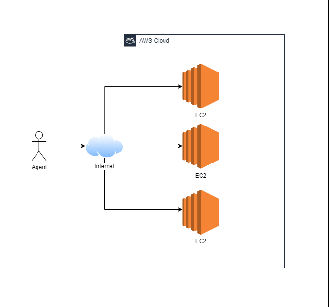
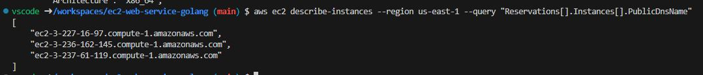
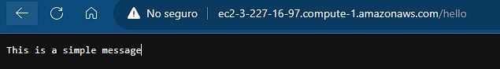
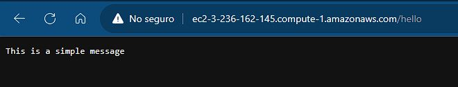
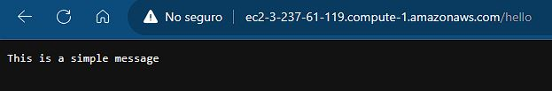

# EC2 web app

A simple web app automatically deployed into 3 EC2 instances.

# Architecture

The architecture of this project is as follows.



- A internet consumer
- 3 EC2 instances that have a simple golang server running in port 80 with HTTP

# Prerequisites

- Docker
- AWS
- Visual studio: dev containers plugin


## How to build the architecture

Open the folder with the dev containers plugin and wait the container to start. The container has the following libraries:
- Golang 1.21.3 or major
- AWS CDK
- AWS CLI


Create a ec2 key pair to access the machines

```bash
aws ec2 create-key-pair --key-name Alejo_key_pair --region us-east-1 --query 'KeyMaterial' --output text > key.pem
```


Build the cloud formation template.

```bash
cdk synth > template.yaml
```

Upload the template to cloud formation

```bash
aws cloudformation create-stack --stack-name EC2-stack --template-body file://template.yml --region us-east-1 --capabilities CAPABILITY_IAM
```

Validate that the stack creation is completed.


Once you are done, delete the resources

```bash
aws cloudformation delete-stack --stack-name EC2-stack --region us-east-1
```

## How the app is desployed

For every VM, a user data script is defined to download this same repository, install golang and execute the web app in [app.go](cmd/app.go)

```go
UserData: awsec2.UserData_ForLinux(&awsec2.LinuxUserDataOptions{
			Shebang: jsii.String("#!/bin/bash\n" +
				"sudo yum update -y\n" +
				"sudo yum install -y golang git wget\n" +
				"cd ~\n" +
				"wget https://go.dev/dl/go1.21.3.linux-amd64.tar.gz\n" +
				"sudo tar -C /usr/local -xzf go1.21.3.linux-amd64.tar.gz\n" +
				"export PATH=$PATH:/usr/local/go/bin\n" +
				"export GOCACHE=$HOME/.cache/go-build\n" +
				"echo $PATH\n" +
				"echo $GOCACHE\n" +
				"echo $HOME\n" +
				"git clone https://github.com/alejovasquero/ec2-web-service-golang.git\n" +
				"cd 'ec2-web-service-golang'\n" +
				"go run cmd/app.go -v"),
		}),
```

## Testing the app

First get the VMs public DNS name.

```bash
aws ec2 describe-instances --region us-east-1 --query "Reservations[].Instances[].PublicDnsName"
```



Select any URL and open it in the browser in port 80 and add the path /hello.

http://ec2-3-227-16-97.compute-1.amazonaws.com/hello





